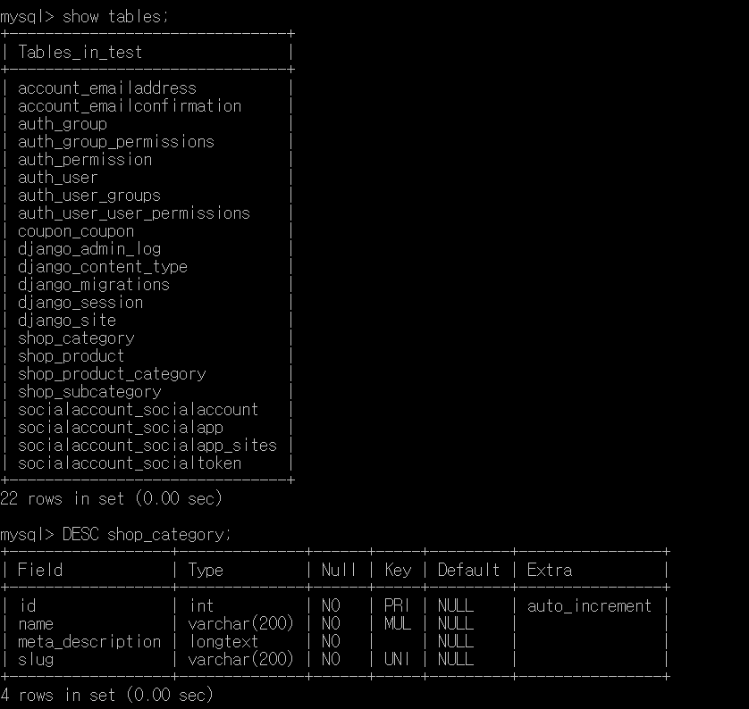

# 쇼핑몰 만들기
필요한 기능: ```제품 목록, 제품 상세 화면, 장바구니, 쿠폰, 소셜 로그인 기능 (주문,결제 부분은 뺐습니다 필요할때 다시 할 예정)```

# 프로젝트 만들기
1. python -m venv venv 가상환경 설치
2. source venv/Scripts/activate 가상환경 실행
3. pip install django 장고설치
4. django-admin startproject config . 장고 프로젝트 만들기   

``` 데이터 베이스 관리 mysql 사용```
1. pip install pymysql 모듈설치
* config/settings.py
```
import pymysql
pymysql.install_as_MYSQLdb() #MYSQLdb와의 호환을 위해 설치

DATABASES = {
    'default': {
        'ENGINE': 'django.db.backends.mysql',
        'NAME': 'DB이름',
        'USER':'DB관리자 계정',
        'PASSWORD':'DB관리자 비밀번호',
        'HOST':'localhost',
        'PORT':'3306',
    }
}
```
2. python manage.py migrate 데이터베이스 초기화
3. python manage.py createsuperuser 관리자계정 생성

```책에서는 AWS를 이용해서 db서버와 이미지 서버를 연결했지만 AWS는 1년 무료긴 해도 1년 후에 취소하는걸 까먹을거 같고 내꺼 비자카드도 없고등의 이유로 그냥 함..```

# SHOP 앱 만들기
## 1. 앱 만들기
* python manage.py startapp shop :shop앱 생성
* config/settings.py
```
INSTALLED_APPS=[
    'shop', 추가
]
```
## 2. 모델 만들기
상품과 카테고리 모델 만들기
* shop/models.py
```
from django.db import models
from django.urls import reverse

class Category(models.Model):
    name=models.CharField(max_length=200,db_index=True)
    meta_description=models.TextField(blank=True)
    slug=models.SlugField(max_length=200,db_index=True,unique=True,allow_unicode=True)

    class Meta:
        ordering=['name']
        verbose_name='category'
        verbose_name_plural='categories'

    def __str__(self):
        return self.name
    def get_absolute_url(self):
        return reverse('shop:product_in_category',args=[self.slug])

class Product(models.Model):
    category=models.ForeignKey(Category,on_delete=models.SET_NULL,null=True,related_name='products')
    name=models.CharField(max_length=200,db_index=True)
    slug=models.SlugField(max_length=200,db_index=True,unique=True,allow_unicode=True)
    image=models.ImageField(upload_to='products/%Y/%m/%d' ,blank=True)
    description=models.TextField(blank=True)
    meta_description=models.TextField(blank=True)
    price=models.DecimalField(max_digits=10,decimal_places=2)
    stock=models.PositiveIntegerField()
    available_display=models.BooleanField('Display',default=True)
    available_order=models.BooleanField('Order',default=True)
    created=models.DateTimeField(auto_now_add=True)
    updated=models.DateTimeField(auto_now=True)

    class Meta:
        ordering:['-created']
        index_together=[['id','slug']]

    def __str__(self):
        return self.name
    def get_absolute_url(self):
        return reverse('shop:product_detail',args=[self.id,self.slug])
```
```Category```
1. name :카테고리 이름
2. db_index=True :카테고리 정보를 저장하는 테이블에서 이 변수 열을 인덱스 열로 설정함
3. meta_description :SEO(Search Engine Optimazation)을 위해 만듦 ,검색인진에서 검색이 잘 되도록 함
3. slug :상품명 등을 이용해 url을 만드는 방식 (allow_unicode=True로 줬지만 영어 외의 언어로 등록하면 오류가 난다.. 해결방법은 밑에서 설명)
4. verbose_name/verbose_name_plural :관리자 페이지에서 보여지는 객체가 단수일 때와 복수일 때를 각각 설정

```Product``` 
1. ForeignKey 필드를 사용해 카테고리 모델과 관계를 맺는다
2. on_delete=SET_NULL: 카테고리를 삭제해도 상품은 남아있어야 하기때문
3. null=True :null값 저장 가능
4. Decimal,PositiveInteger,Boolean등 다양한 필드 존재
5. index_together :멀티 컬럼 인덱스 기능으로 id와 slug 필드를 묶어서 인덱싱이 가능하도록 해줌

* 데이터 베이스에 반영
1. python manage.py makemigrations shop
2. python manage.py migrate shop



1. use DB이름; :사용할 DB선택
2. show tables; :저장된 table 확인
3. DESC tablename; :table 안 필드 확인

## 3. 뷰 만들기
카테고리 페이지와 상품 페이지 만들기
* shop/views.py
```
from django.shortcuts import render,get_object_or_404
from .models import *

def product_in_category(request,category_slug=None):
    current_category=None
    categories=Category.objects.all()
    products=Product.objects.filter(available_display=True)

    if category_slug:
        current_category=get_object_or_404(Category,slug=category_slug)
        products=products.filter(category=current_category)
    return render(request,'shop/list.html',{'current_category':current_category,'categories':categories,'products':products})


def product_detail(request,id,product_slug=None):
    product=get_object_or_404(Product,id=id,slug=product_slug)
    return render(request,'shop/detail.html',{'product':product})
```

```카테고리 페이지```
1. url로부터 category_slug를 찾아 어느 카테고리를 보여주는지 판단 선택한 카테고리 없으면 전체 상품 목록 출력
2. 상품은 선택한 카테고리가 있으면 현재 카테고리 filter를 걸어서 선택
3. list.html 탬플릿 반환, 변수 전달

```상품 페;이지```
1. url로부터 slug값을 읽어와 해당 상품을 찾음
2. get_object_or_404 :찾는 객체가 없으면 404페이지 리턴

## 4. URL연결
* shop/urls.py
```
from django.urls import path
from .views import *

app_name='shop'

urlpatterns=[
    path('',product_in_category,name='product_all'),
    path('<category_slug>/',product_in_category,name='product_in_category'),
    path('<int:id>/<product_slug>/',product_detail,name='product_detail'),
]
```
1. ```<slug:category_slug>``` : 이런식으로 쓰면 영어 외의 언어에서 오류 발생    
```<category_slug>/<str:category_slug>/re_path(r'^(?P<category_slug>[-\w]+)/$',)로 사용```

* config/urls.py
```
from django.contrib import admin
from django.urls import path,include

urlpatterns=[
    path('admin/',admin.site.urls),
    path('',include('shop.urls')) 
]
```
shop 앱의 url include하여 연결

## 5.템플릿 만들기
* templates/base.html
```
<!DOCTYPE html>
<html lang="en">
<head>
    <meta charset="UTF-8">
    <meta name="viewport" content="width=device-width, initial-scale=1.0">
    <title></title>
    
    <link rel="stylesheet" href="https://stackpath.bootstrapcdn.com/bootstrap/4.4.1/css/bootstrap.min.css" integrity="sha384-Vkoo8x4CGsO3+Hhxv8T/Q5PaXtkKtu6ug5TOeNV6gBiFeWPGFN9MuhOf23Q9Ifjh" crossorigin="anonymous">
    <script src="https://code.jquery.com/jquery-3.3.1.min.js"crossorigin="anonymous"></script>
    <script src="https://cdn.jsdelivr.net/npm/popper.js@1.16.0/dist/umd/popper.min.js" integrity="sha384-Q6E9RHvbIyZFJoft+2mJbHaEWldlvI9IOYy5n3zV9zzTtmI3UksdQRVvoxMfooAo" crossorigin="anonymous"></script>
    <script src="https://stackpath.bootstrapcdn.com/bootstrap/4.4.1/js/bootstrap.min.js" integrity="sha384-wfSDF2E50Y2D1uUdj0O3uMBJnjuUD4Ih7YwaYd1iqfktj0Uod8GCExl3Og8ifwB6" crossorigin="anonymous"></script>
    
    
    

    
    
</head>
<body>
    # 네비게이션 바 설정
    <nav class="navbar navbar-expand-lg navbar-light bg-light">
        <a class="navbar-brand" href="/">Django Shop</a>
        <button class="navbar-toggler" type="button" data-toggle="collapse" data-target="#navbarSupportedContent" aria-controls="navbarSupportedContent" aria-expanded="false" aria-label="Toggle navigation">
            <span class="navbar-toggler-icon"></span>
        </button>
        <div class="collapse navbar-collapse justify-content-end" id="navbarSupportedContent">
            <ul class="navbar-nav justify-content-end">
                # 카트 설정
                <li class="nav-item active">
                    <a class="nav-link btn btn-outline-success" href="">Cart
                        
                            ${{cart.get_product_total}}with{{cart|length}}items
                        
                            :Empty
                        
                    </a>
                </li>
            </ul>
        </div>
    </nav>
    <div class="container">
        
        
    </div>
</body>
</html>
```
제이쿼리 slim이 아닌 minified버전으로 적용->ajax 기능 때문
* config/settings.py
```
templates 폴더를 템플릿 폴더 경로에 등록
'DIRS':[os.path.join(BASE_DIR,'templates')]
```
* shop/templates/shop/list.html
```

Category Page

<div class="row">
    <div class="col-2">
        <div class="list-group">
            <a href="/" class="list-group-item active">All</a> 
            
            <a href="{{c.get_absolute_url}}" class="list-group-item active">{{c.name}}</a>
            
        </div>
    </div>
    <div class="col">
        <div class="alert alert-info" role="alert">
            {{current_category.name}}All Products
        </div>
        <div class="row">
            
            <div class="col-4">
                <div class="card">
                    
                    <div class="card-body">
                        <h5 calss="card-title">{{product.name}}</h5>
                        <p class="card-text">{{product.description}}<span class="badge badge-secondary">${{product.price}}</span></p>
                        <a href="{{product.get_absolute_url}}" class="btn btn-primary">View Detail</a>
                    </div>
                </div>
            </div>
            
        </div>
    </div>
</div>

```
* shop/templates/shop/detail.html
```

Product Detail

<div class="container">
    <div class="row">
        <div class="col-4">
            
        </div>
        <div class="col">
            <h1 class="display-6">{{product.name}}</h1>
            <p><span class="badge badge-secondary">Price</span>{{product.price}}</p>
            <form action="" method="POST">
                {{add_to_cart}}
                
                <input type="submit" class="btn btn-primary btn-sm" value="Add to Cart">
            </form>
            <h5><span class="badge badge-secondary">Description</span>{{product.description|linebreaks}}</h5>
        </div>
    </div>
</div>

```
## 6.관리자 페이지 등록
* shop/admin.py
```
from django.contrib import admin
from . models import *

class CategoryAdmin(admin.ModelAdmin):
    list_display=['name','slug']
    prepopulated_fields={'slug':('name',)}

class ProductAdmin(admin.ModelAdmin):
    list_display=['name','slug','category','price','stock','available_display','available_order','created','updated']
    list_filter=['available_display','created','updated','category']
    prepopulated_fields={'slug':('name',)}
    list_editable=['price','stock','available_display','available_order']

admin.site.register(Category,CategoryAdmin)
admin.site.register(Product,ProductAdmin)
```
1. prepopulated_fields: slug 필드는 name 필드의 값에 따라 자동으로 설정
2. list_editable: 목록에서 바로 변경 가능

# 소셜 로그인 추가하기
1. pip install django-allauth 
2. config/settings.py에 앱 등록
```
INSTALLED_APPS=[
    'shop',
    'django.contrib.sites', #사이트 정보 설정
    'allauth',
    'allauth.account', #가입한 계정 관리
    'allauth.socialaccount', #소셜 계정으로 가입한 계정 관리
    'allauth.socialaccount.providers.naver', #어떤 소셜 서비스를 사용하는지
]

#어떤 형식의 로그인을 사용할지 결정
AUTHENTICATION_BACKENDS=(
    'django.contrib.auth.backends.ModelBackend',
    'allauth.account.auth_backends.AuthenticationBackend',
)

SITE_ID=1
LOGIN_REDIRECT_URL='/'
```
 장고 기본 로그인-> 사용자명   
allauth-> 이메일   
 관리자 페이지등에 사용자명으로 로그인 하기 위해 ModelBackend 추가
* config/urls.py url에 추가
```
urlpatterns=[
    path('accounts/',include('allauth.urls'))
]
```
python manage.py migrate 추가한 앱들의 데이터베이스 적용

* templates/base.html에 로그인 추가
```
<li class="nav-item active">
    
    <a class="nav-link" href="">Logout</a>
    
    <a class="nav-link" href="">Login</a>
    
</li>
```
소셜 사이트에서 API키 발급 받기   
1. 네이버 개발자 사이트에 접속해 로그인 API 이용 신청 버튼 클릭
2. 필요한 정보 등록
서비스 url:http://127.0.0.1:8000
callback url:http://127.0.0.1:8000/accounts/naver/login/callback/
3. client ID/client Secret을 장고 관리자 페이지 social applications 모델에 등록

# Cart 앱 만들기
## 1. 앱 만들기
python manage.py startapp cart
* config/settings.py
```
INSTALLED_APPS=[
    'cart', 추가
]
```

## 2. 카트 클래스 만들기
데이터베이스에 저장하는 방식(모델 생성) or 세션 기능 활용   
->이번에는 세션을 이용해 만들어 봄   

```세션이란?```
1. 사이트와 특정 브라우저 사이의 state를 유지시키는 것
2. 세션은 당신이 매 브라우저마다 임의의 데이터를 저장하게 하고 이 데이터가 브라우저에 접속할 때마다 사이트에서 활용될 수 있도록 한다
3. 세션에 연결된 각각의 데이터 아이템들은 key에 의해 인용되고 이는 또다시 데이터를 찾거나 저장하는 데에 이용된다
4. 장고는 특정 session id를 포함하는 쿠키를 사용하여 각각의 브라우저와 사이트가 연결된 세션을 알아낸다
5. session 속성은 request에서 파생된 view안에 있다
6. 장고는 세션 데이터를 세션 DB에 저장한다 그리고 session 쿠키를 필요할때 client에게 보낸다 
* cart/cart.py
```
from decimal import Decimal
from django.conf import settings
from shop.models import Product

class Cart(object):
    def __init__(self,request): #초기화
        self.session=request.session
        cart=self.session.get(settings.CART_ID) #CART_ID로 session 받아오기
        if not cart: #카트가 비었으면 {}
            cart=self.session[settings.CART_ID]={}
        self.cart=cart #카트 등록
    
    def __len__(self):
        return sum(item['quantity'] for item in self.cart.values())

    def __iter__(self):
        product_ids=self.cart.keys() #카트의 key 받아오기
        products=Product.objects.filter(id__in=product_ids) #Product에서 product_ids 필터를 이용해 상품 받아옴
        for product in products:
            self.cart[str(product.id)]['product']=product
        for item in self.cart.values():
            item['price']=Decimal(item['price'])
            item['total_price']=item['price']*item['quantity']
            yield item

    def add(self,product,quantity=1,is_update=False):
        product_id=str(product.id)
        if product_id not in self.cart:
            self.cart[product_id]={'quantity':0,'price':str(product.price)}

        if is_update:
            self.cart[product_id]['quantity']=quantity
        else:
            self.cart[product_id]['quantity']+=quantity
        self.save()

    def save(self):
        self.session[settings.CART_ID]=self.cart
        self.session.modified=True

    def remove(self,product):
        product_id=str(product.id)
        if product_id in self.cart:
            del(self.cart[product_id])
            self.save()

    def clear(self):
        self.session[settings.CART_ID]={}
        self.session['coupon_id']=None
        self.session.modified=True

    def get_product_total(self):
        return sum(Decimal(item['price'])*item['quantity'] for item in self.cart.values())
        
```
1. sum: 시작값에서 반복되는 값들의 합을 반환
2. yield: 제너레이터 반환 (제너레이터란? 모든 값을 메모리에 담고 있지 않고 그때그때 값을 생성해서 반환하기 때문에 한번에 한 개의 값만 순환 할 수 잇는 이터레이터)
3. self.session.modified -> session은 스스로 데이터가 업데이트 된것을 알 수 없기때문에 따로 표시해 줘야 한다

* config/settings.py 세션 아이디 추가
```
CART_ID='cart_in_session' 
```

* cart/forms.py 카트 기능은 사용자에게 입력을 받는것이기 때문에 폼을 만들어 뷰에서 활용
```
from django import forms

class AddProductForm(forms.Form):
    quantity=forms.IntegerField()
    is_update=forms.BooleanField(required=False,initial=False,widget=forms.HiddenInput)
```
1. is_update: 상세 페이지에서 추가할 때와 장바구니에서 수량을 바꿀 때 동작하는 방식을 달리하려고 사용하는 변수   
ex)상세 페이지-> 제품 수량을 선택하고 추가할 때마다 현재 장바구니 수량에 더해지는 방식 is_update=False   
장바구니-> 수량을 변경하는 것은 그 값 그대로 현재 수량에 반영해야 하기 때문에 is_update=True
2. widget=forms.HiddenInput: 유저가 직접 입력하지 않고 브라우저에서 자동으로 입력

* cart/views.py
```
from django.shortcuts import render,redirect,get_object_or_404
from django.views.decorators.http import require_POST
from shop.models import Product
from .forms import AddProductForm
from .cart import Cart

@require_POST
def add(request,product_id):
    cart=Cart(request)
    product=get_object_or_404(Product,id=product_id)

    form=AddProductForm(request.POST)
    if form.is_valid():
        cd=form.cleaned_data
        cart.add(product=product,quantity=cd['quantity'],is_update=cd['is_update'])
    return redirect('cart:detail')

def remove(request,product_id):
    cart=Cart(request)
    product=get_object_or_404(Product,id=product_id)
    cart.remove(product)
    return redirect('cart:detail')

def detail(request):
    cart=Cart(request)
    for product in cart:
        product['quantity_form']=AddProductForm(initial={'quantity':product['quantity'],'is_update':True})
    return render(request,'cart/detail.html',{'cart':cart,})

```
1. add(상품 추가): 제품 상세 페이지,장바구니 페이지로부터 전달되며 AddProductForm을 통해 만들어진 데이터임
2. detail(장바구니 페이지): 노츨될 제품들을 카트 객체로부터 가져옴 제품 수량 수정을 위해 AddProductForm을 제품마다 하나씩 추가해줌

## 3. URL 연결
* cart/urls.py
```
from django.urls import path
from .views import *

app_name='cart'

urlpatterns=[
    path('',detail,name='detail'),
    path('add/<int:product_id>',add,name='product_add'),
    path('remove/<product_id>',remove,name='product_remove'),
]
```
* config/urls.py :cart url include
```
urlpatterns=[
    path('cart/',include('cart.urls')), 
]
```
## 4. 템플릿 만들기
* cart/templates/cart/detail.html
```



Shopping Cart


<table class="table table-striped">
    <thead>
        <tr>
            <th scope="col">Image</th>
            <th scope="col">Product</th>
            <th scope="col">Quantity</th>
            <th scope="col">Remove</th>
            <th scope="col">Unit price</th>
            <th scope="col">Price</th>
        </tr>
    </thead>
    <tbody>
        
        
        <tr>
            <th scope="row">
                <a href="{{product.get_absolute_url}}"></a>
            </th>
            <td>{{product.name}}</td>
            <td>
                <form action="" method="POST">
                    {{item.quantity_form.quantity}}
                    {{item.quantity_form.is_update}}
                    <input type="submit" class="btn btn-primary" value="Update">
                    
                </form>
            </td>
            <td>
                <a href="">Remove</a>
            </td>
            <td class="num">${{item.price}}</td>
            <td class="num">${{item.total_price}}</td>
        </tr>
        
        
        <tr class="total">
            <td>Total</td>
            <td colspan="4"></td>
            <td class="num">${{cart.get_total_price|floatformat:"2"}}</td>
        </tr>
        
    </tbody>
</table>
<p class="text-right">
    <a href="" class="btn btn-secondary">Continue Shopping</a>
</p>

```
## 5.제품 상세페이지 수정
* shop/views.py 장바구니에 담기 기능 활성화
```
form cart.forms import AddProductForm

def product_detail(request,id,product_slug=None):
    product=get_object_or_404(Product,id=id,slug=product_slug)
    add_to_cart=AddProductForm(initial={'quantity':1}) 
    return render(request,'shop/detail.html',{'product':product,'add_to_cart':add_to_cart})
```
AddProductForm 객체를 만들고 템플릿 변수로 전달

* shop/templates/shop/detail.html
```
<form action="" method="POST">
    {{add_to_cart}}
    
    <input type="submit" class="btn btn-primary btn-sm" value="Add to Cart">
</form>
```
add_to_cart 변수 출력
* templates/base.html href에 url 템플릿 태그 추가
```
 <a class="nav-link btn btn-outline-success" href="">Cart
```

# 쿠폰 앱 만들기
## 1.앱 만들기
python manage.py startapp coupon
* config/settings.py coupon앱 추가
```
INSTALLED_APP=[
    'coupon', 
]
```
## 2.모델 만들기
* coupon/models.py
```
from django.db import models
from django.core.validators import MinValueValidator,MaxValueValidator

class Coupon(models.Model):
    code=models.CharField(max_length=50,unique=True)
    use_from=models.DateTimeField() #사용기간 설정
    use_to=models.DateTimeField()
    amount=models.IntegerField(validators=[MinValueValidator(0),MaxValueValidator(100000)])
    active=models.BooleanField()

    def __str__(self):
        return self.code

```
1. validators=[MinValueValidator(0),MaxValueValidator(100000)] : 0~100000 까지 금액 범위 제한

데이터베이스에 모델 적용   
python manage.py makemigrations coupon   
python manage.py migrate coupon

## 3.뷰 만들기
* coupon/forms.py 폼을 통해 데이터 전달
```
from django import forms

class AddCouponForm(forms.Form):
    code=forms.CharField(label='your coupon code')
```
* coupon/views.py
```
from django.shortcuts import render,redirect
from django.utils import timezone
from django.views.decorators.http import require_POST
from .models import Coupon
from .forms import AddCouponForm

@require_POST
def add_coupon(request):
    now=timezone.now()
    form=AddCouponForm(request.POST)
    if form.is_valid():
        code=form.cleaned_data['code']
        try:
            coupon = Coupon.objects.get(code__iexact=code, use_from__lte=now, use_to__gte=now, active=True)
            request.session['coupon_id'] = coupon.id
        except Coupon.DoesNotExist:
            request.session['coupon_id']=None
    return redirect('cart:detail')
```
1. AddCouponForm으로 쿠폰 폼 받아옴
2. __옵션 :iexact-대소문자 구분x / lte-lessthanequal gte-graterthanequal (use_from은 현재보다 이전 use_to는 현재 이후)
## 4.URL연결
* coupon/urls.py 
```
from django.urls import path
from .views import add_coupon

app_name='coupon'

urlpatterns=[
    path('add/',add_coupon,name='add'),
]
```
* config/urls.py
```
urlpatterns=[
    path('coupon/',include('coupon.urls')),
]
```

## 5.카트 수정하기 
쿠폰은 장바구니에서 사용하기때문
* cart/cart.py
```
from coupon.models import Coupon

def __init__(self,request):
    ...
    self.coupon_id=self.session.get('coupon_id') #초기화 메소드에서 쿠폰 아이디 불러옴

def clear(self):
    self.session['coupon_id']=None #장바구니 비울때 쿠폰도 삭제

@property
    def coupon(self):
        if self.coupon_id:
            return Coupon.objects.get(id=self.coupon_id)
        return None

    def get_discount_total(self): #쿠폰 할인 금액
        if self.coupon:
            if self.get_product_total() >= self.coupon.amount:
                return self.coupon.amount
        return Decimal(0)

    def get_total_price(self): #할인된 금액 계산
        return self.get_product_total() - self.get_discount_total()
```
1. 쿠폰을 프로퍼티 형태로 만들어줌
(값을 가져오는 메서드에는 @property 데코레이터를 붙이고, 값을 저장하는 메서드에는 @메서드이름.setter 데코레이터를 붙이는 방식)
2. 프로퍼티 사용 목적: 변수를 변경할 때 제한을 두고 싶어서, get&set 함수를 만들지 않고 더 간단하게 접근하기 위해등..

* cart/views.py 쿠폰 폼 추가
```
def detail(request):
    add_coupon=AddCouponForm()
    cart=Cart(request)
    for product in cart:
        product['quantity_form']=AddProductForm(initial={'quantity':product['quantity'],'is_update':True})
    return render(request,'cart/detail.html',{'cart':cart,'add_coupon':add_coupon})
```

* cart/templates/cart/detail.html 템플릿에서 쿠폰 부분 출력
```
 #쿠폰이 있을때만 보여줌
    <tr class="subtotal">
        <td>subtotal</td>
        <td colspan="4"></td>
        <td>${{cart.get_product_total}}</td>
    </tr>
    <tr>
        <td>"{{cart.coupon.code}}" coupon ({{cart.coupon.amount}})</td>
        <td colspan="4"></td>
        <td>- ${{cart.get_discount_total|floatformat:"2"}}</td>
    </tr>

<p>Add Coupon:</p> #쿠폰 입력받는 폼 출력
<form action="" method="POST">
    {{add_coupon}}
    <input type="submit" value="add">
    
</form>
```
## 6.관리자 페이지에 모델 등록
* coupon/admin.py
```
from django.contrib import admin
from .models import Coupon

class CouponAdmin(admin.ModelAdmin):
    list_display=['code','use_from','use_to','amount','active']
    list_filter=['active','use_from','use_to']
    search_fields=['code']

admin.site.register(Coupon,CouponAdmin)
```
* templates/base.html 할인된 금액 카트에서 확인 할 수 있도록 변경
```

    ${{cart.get_total_price}}with{{cart|length}}items
```
# 컨텍스트 프로세서 만들기
컨텍스트 프로세서란?   
모든 템플릿을 해석할 때 항상 처리해야 하는 정보가 있을 때 담당하는 기능 ->장바구니 정보가 장바구니로 이동했을때는 보이는데 그 외에는 보이지 않음(Cart 추가해줘도 됨)
* cart/context_processors.py 
```
from .cart import Cart

def cart(request):
    cart=Cart(request)
    return {'cart':cart}
```
* config/setting.py 템플릿 변수에 context_processors 등록
```
#템플릿 옵션부분에
'cart.context_processors.cart' 추가
```
